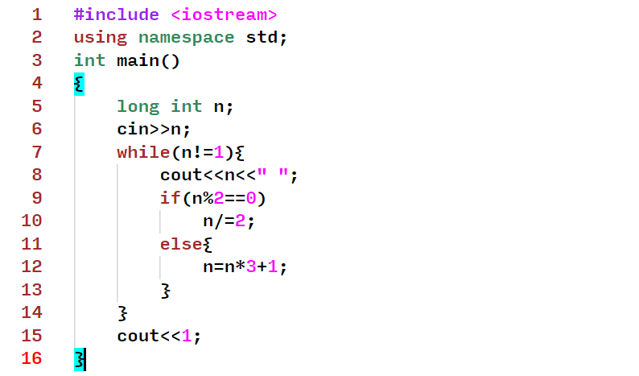

# gVim Theme
Vscode Theme base on gVim ([Vim](https://www.vim.org/download.php)).



## Installing

Available free in the [Visual Studio Code Market Place](https://marketplace.visualstudio.com/items?itemName=ichsn.gvim-theme)


## Customization
### Cursor
If you want to change the cursor style like vim (terminal cursor), you can change it in settings and change the cursor style to block
```json
{
  "editor.cursorStyle": "block"
 }
```
### Custom Font
The custom font used in the screenshot is [Input Mono Medium](https://input.djr.com/) Font.

##### *this theme is under development*